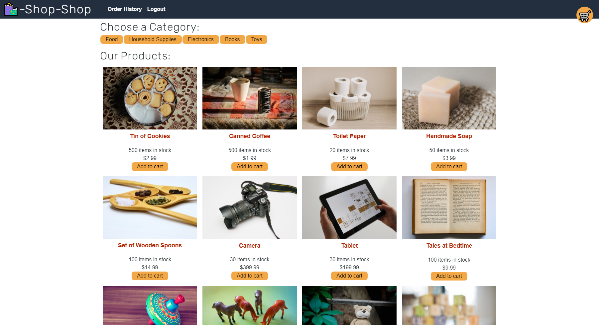

# Shop-Shop
## Description
Simple E-Commerce Website that utilizes stripe for payments.
## Installation
Clone repository and run `npm install`. Run `npm run seed`. Run `npm run develop`.
## Usage
Deployed at https://pacific-meadow-56732.herokuapp.com

## Credits
Stripe
## Features
Handles purchases through Stripe `(test mode)`
## Tests
Change directory to `/client` and run `npm run test` utilizes Jest
